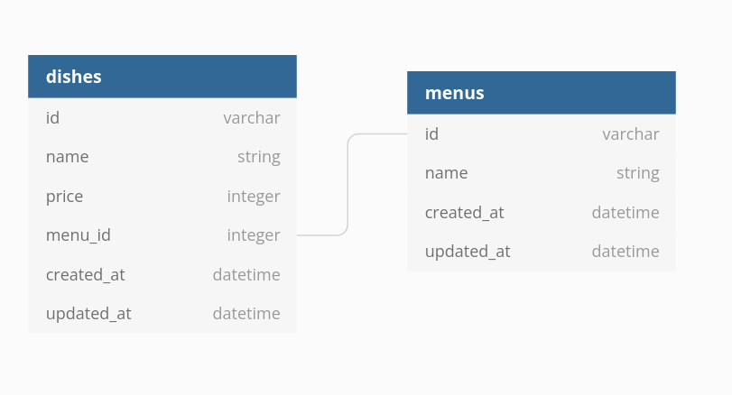
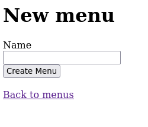
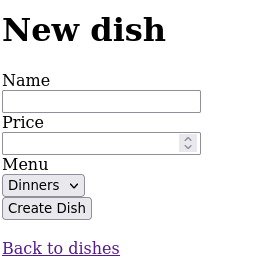
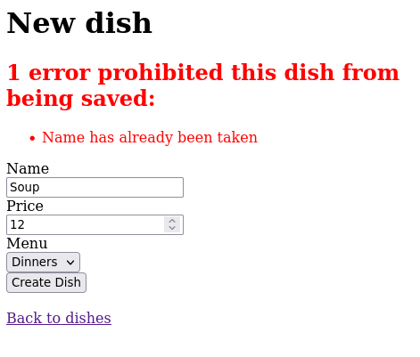
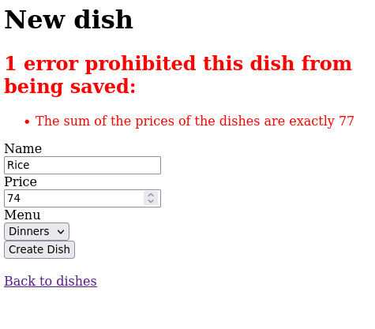

<!-- Badges -->
<p>
  
  <a href="#" target="_blank">
    
  </a>
  <a href="https://twitter.com/redacuve" target="_blank">
    
  </a>
</p>


<!-- Project Header -->
  <p align="center">
  <br>
  <h1 align="center">Menu Manager Test</h1>
  <p align="center">
  <br>
   <a href="https://github.com/redacuve/menu-manager-code-test-rails"><strong>Explore the repo »</strong></a>
  <br>
    <a href="https://github.com/redacuve/menu-manager-code-test-rails/issues">Request Feature</a>
  </p>

<!-- TABLE OF CONTENTS -->

## Table of Contents

* [About the Project](#about-the-project)

* [Entity Relationship Diagram](#entity-relationship-diagram)

* [Built With](#built-with)

* [Getting Started](#getting-started)

* [How it Works](#how-it-works)

* [Using Docker](#using-docker)

* [Contributing](#contributing)

* [License](#license)

* [Contact](#contact)

<!-- ABOUT THE PROJECT -->

## About The Project

This is the response a test for OpenTable, with this app you can add a Menu, the Menu has different names, like Starters, Dinners, Mains, and also you can add Dishes to the Menu, every Dish name is unique, you cannot have the same Dish in different Menus, also it has a Endpoint where you can see all the Menus with the Dishes.

## Entity Relationship Diagram

<h3 align="center">Entity Relationship Diagram</h3>
<p align="center">
  
</p>


### Built With

* [Ruby](https://ruby-doc.org/core-2.7.5/)

* [HTML5](https://developer.mozilla.org/es/docs/HTML/HTML5)

* [SQLLite3](https://www.sqlite.org/docs.html)

<!-- GETTING STARTED -->

## Getting Started

If you want to get a local copy up and running follow these simple steps.

Clone or fork the <a href="https://github.com/redacuve/menu-manager-code-test-rails">repo</a> [git@github.com:redacuve/menu-manager-code-test-rails.git]

Note* Ruby and Rails needs to be installed to run the code, check [here](https://www.ruby-lang.org/en/documentation/installation/) and [here](https://guides.rubyonrails.org/getting_started.html) for further steps.

<!-- HOW IT WORKS -->
## How it Works
<div align="center">

</div>

* You can Add a new Menu.

<div align="center">

</div>

* With at least one Menu, you can add Dished to the menus.

<div align="center">

</div>

* The dishes must be unique, there can't be two dishes with the same name

<div align="center">

</div>

* Also you cannot add a Dish if the price of the dishes including the desire one to be add is exactly 77.

## Using Docker    
### Initial setup

- Build the docker image: `docker-compose build`
- Create the databases: `docker-compose run web rails db:setup`

### Running the app and regular tasks

- Start the Rails app server: `docker-compose up`
- Run the tests: `docker-compose run web rails test`
- Generate a new model: `docker-compose run web rails generate model widget name:string`
- Run migrations: `docker-compose run web rails db:migrate`

### Running the code

*   Navigate to the root directory of the project

*   Run this command on your terminal to install all the needed gems:
    ```
    $ bundle install
    ```
*   Install Yarn
    ```
    $ yarn install --check-files
    ```
*   Create and migrate the database
    ```
    $ rails db:create
    $ rails db:migrate
    ```
*   Run the develpment server with
    ```
    $ rails server
    ```
*   Visit the proyect page
    ```
    https://localhost:3000
    ```

<!-- CONTRIBUTING -->

## Contributing

Contributions are what make the open source community such an amazing place to be learn, inspire, and create. Any contributions you make are **greatly appreciated**.

1. Fork the Project

2. Create your Feature Branch (`git checkout -b feature/AmazingFeature`)

3. Commit your Changes (`git commit -m 'Add some AmazingFeature'`)

4. Push to the Branch (`git push origin feature/AmazingFeature`)

5. Open a Pull Request

<!-- LICENSE -->

## License

This project is under the <a href="https://www.gnu.org/licenses/gpl-3.0.html">GNU Public License V3</a>. For more information see <a href="https://github.com/redacuve/lakastapp/blob/master/LICENSE">here</a>

<!-- CONTACT -->

## Contact

Rey David Cuevas Vela - [@redacuve](https://twitter.com/redacuve) - redacuve@gmail.com -[linkedin.com/in/redacuve/](https://www.linkedin.com/in/redacuve/)

Project Link: [github.com/redacuve/menu-manager-code-test-rails](https://github.com/redacuve/menu-manager-code-test-rails) - Menu Manager.
